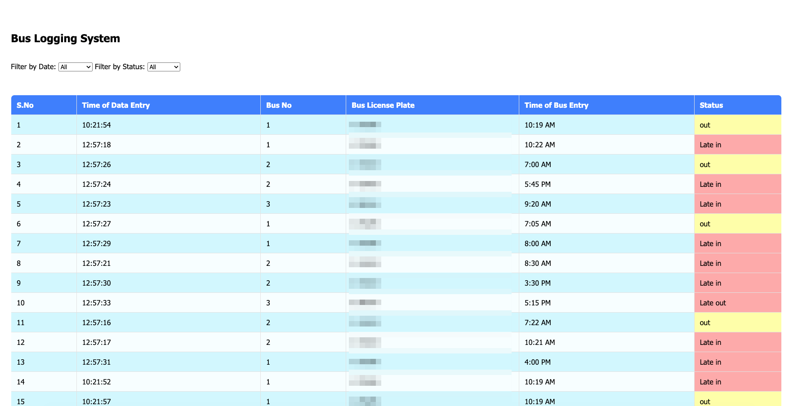
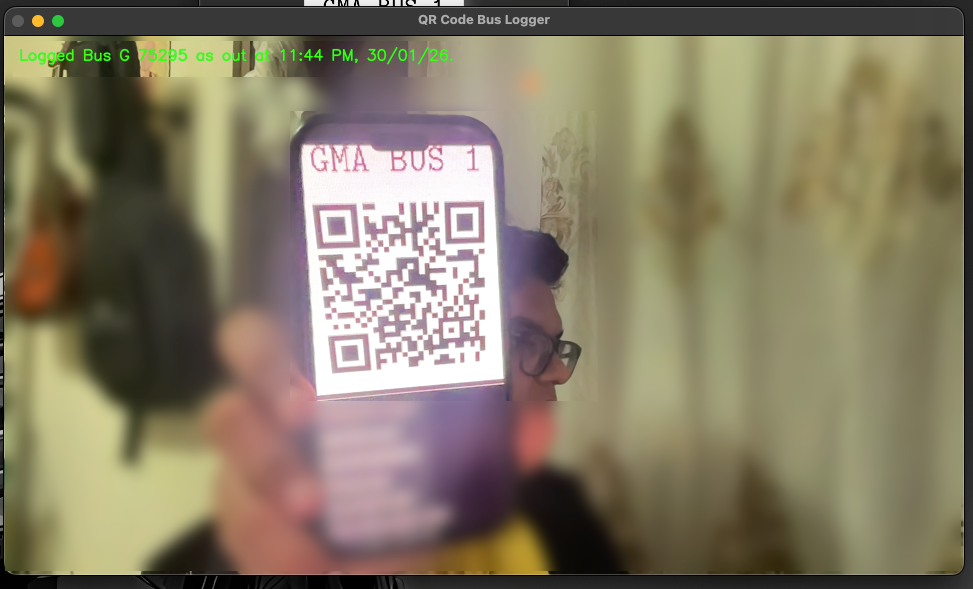
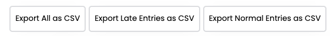

# Bus Logging System

A QR code-based bus logging system built with Python, OpenCV, and Firebase, originally developed for GEMS Modern Academy to track bus entries and exits in real-time.

---

## Features

* Scan buses using QR codes via camera (main.py) and log entry/exit.
* Automatic log creation and upload to Firebase Firestore using uploader.py.
* Web dashboard (app.py) built with Flask to:

  * View logs in real-time
  * Filter and export data
  * Flag late buses:

    * Entry after 7:45 AM → Late In
    * Exit after 3:20 PM → Late Out

---

## File Structure

```
.
├── app.py                  - Flask web app to view/filter/export bus logs
├── main.py                 - Camera interface to scan QR codes and create logs
├── qrcode_generator
│   ├── cmtt10.ttf          - Font file for QR code generation
│   └── codeGen.py          - Script to generate QR codes for buses
├── requirements.txt        - Python dependencies
├── screenshots
│   ├── IMG1.png
│   ├── IMG2.png
│   └── IMG3.png
├── templates
│   └── bus_logs.html       - HTML template for Flask app
└── uploader.py             - Upload logs to Firebase Firestore
```

---

## How It Works

1. Run main.py to start the camera.

   * Scans QR codes on buses.
   * Logs BusNo, BusLicense, Time, Status (in/out).
   * Press q to quit: generates log file and uploads data to Firebase via uploader.py.

2. Data format in Firestore (bus_logs collection):

```
Field       : Example    : Type
---------------------------------
BusLicense  : SAMPLE     : string
BusNo       : 1          : number
DataTime    : 10:21:54   : string
Date        : 08/11/24   : string
Status      : out        : string
Time        : 10:19 AM   : string
```

3. Run app.py to open the web dashboard at [http://127.0.0.1:5000](http://127.0.0.1:5000)

   * View logs, filter by date or bus, export to CSV.
   * Late buses automatically flagged.

---

## QR Code Generation

1. Place a buses.csv file in the qrcode_generator directory with this format:
   BusNo,BusLicense,Status,BusType

2. Run the QR code generator:
   python qrcode_generator/codeGen.py

* This will generate QR codes for each bus.
* The generated QR codes can then be scanned by main.py to log entries and exits.

---

## Tech Stack

* Python 3.12
* OpenCV (cv2) + pyzbar (QR code scanning)
* Flask (web dashboard)
* Firebase Firestore (database)
* Pillow (QR code generation)

---

## Screenshots

  

  



---

## Installation

1. Clone the repo:
   git clone [https://github.com/JishnuSetia/BusLoggingSystem.git](https://github.com/JishnuSetia/BusLoggingSystem.git)
   cd BusLoggingSystem

2. Create a virtual environment and activate it:
   python3 -m venv .venv
   source .venv/bin/activate

3. Install dependencies:
   pip install -r requirements.txt

4. Add Firebase credentials JSON in the project root and update main.py / uploader.py.

---

## Getting Firebase Credentials

1. Create a project in Firebase

2. Activate Firestore Database

3. Go to Project Settings > Service accounts

4. Click Generate new private key, which will download a JSON file

---

## Usage

1. Generate QR codes (if not already created).

2. Run main.py to scan buses.

3. Quit main.py to automatically upload logs to Firebase.

4. Run app.py to view logs on the web dashboard.

---

## Notes

* Do not commit .venv/, generated logs, or Firebase credentials.

* Late in/out flags are hardcoded in bus_logs.html.

* Ensure camera works for QR scanning.

---

## License

No license — all rights reserved.

